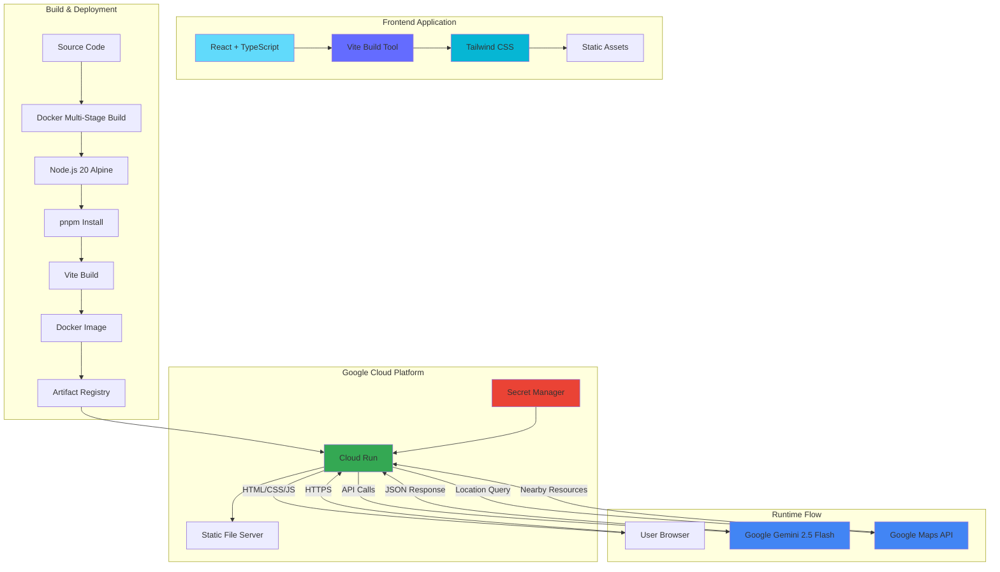
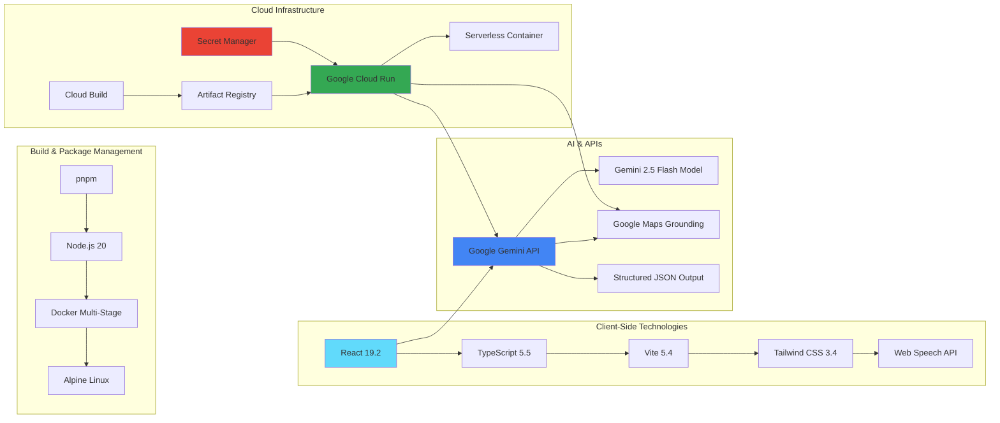

# 🚨 Rapid Response AI: Multimodal Emergency Incident Analyzer

**When seconds count, Rapid Response AI delivers critical intelligence.**

Rapid Response AI is an advanced, AI-powered emergency assistance platform that provides real-time, structured analysis of emergency situations. Built with Google's Gemini 2.5 Flash model, this application transforms how first responders and bystanders assess and respond to critical incidents—from traffic accidents and medical emergencies to fires, natural disasters, and security threats.

## 🎯 Evolution & Mission

**From Hospital-Focused to Comprehensive Emergency Response**

What began as a specialized tool for analyzing traffic accidents and locating nearby hospitals has evolved into a comprehensive emergency response system. Rapid Response AI now handles:

- 🏥 **Medical Emergencies** - Accidents, injuries, cardiac events, and health crises
- 🔥 **Fire Incidents** - Structure fires, wildfires, and fire-related emergencies  
- 🚔 **Security Threats** - Criminal activity, active threats, and public safety incidents
- 🚑 **Multi-Service Coordination** - Intelligent routing to hospitals, fire stations, police, and ambulance services

## ⚡ Key Capabilities

### Intelligent Severity Assessment
The system categorizes incidents into four severity levels with color-coded visual indicators:
- 🔴 **Critical** - Immediate life-threatening situations requiring urgent intervention
- 🟠 **Severe** - Serious injuries or dangerous conditions needing rapid response
- 🟡 **Moderate** - Significant incidents requiring professional attention
- 🟢 **Minor** - Low-risk situations with minimal immediate danger

### Prioritized Action Items
Every analysis includes a **prioritized, actionable checklist** that guides responders through critical steps in order of importance:
1. **Immediate Safety** - Secure the scene and protect lives
2. **Emergency Services** - Contact appropriate responders with **location-aware emergency numbers** (911 for USA, 108 for India, 999 for UK, etc.)
3. **Stabilization** - Basic first aid and scene management
4. **Resource Coordination** - Connect with nearby emergency facilities

### Multimodal Intelligence
- 📝 **Text Analysis** - Natural language processing of incident descriptions
- 📸 **Image Recognition** - Visual analysis of photos to assess damage, injuries, and scene conditions
- 📍 **Geolocation Intelligence** - Automatic detection of nearby emergency resources based on incident type
- 🗣️ **Voice Input** - Speech-to-text for hands-free reporting in high-stress situations
- 🌍 **Location-Aware Emergency Numbers** - Automatically suggests the correct emergency number based on user's location (911 for USA, 108 for India, 999 for UK, 112 for EU, etc.)

### Real-Time Resource Discovery
Automatically locates and provides direct navigation links to:
- Hospitals and medical facilities
- Fire stations and rescue services
- Police stations and security resources
- Ambulance services and emergency medical transport

View your app in [AI Studio](https://ai.studio/apps/drive/1O9LowMYc6D-Glsu06gXrlWcuXV9A1eVR)

---

## ✨ Application Goal and User Experience (UX)

The primary goal is to provide a reliable, step-by-step assessment for first responders or bystanders in high-stress emergency situations. Rapid Response AI bridges the critical gap between incident occurrence and professional response, delivering structured, actionable intelligence that can save lives.

### User Flow: Simple and Intuitive

The application's interface guides the user through three simple steps (as seen in the screenshot):
1.  **Describe the incident:** Input text description of the emergency.
2.  **Upload a photo (Optional):** Provide visual context for multimodal analysis.
3.  **Get location:** Capture precise geolocation for finding nearby resources.

### Enhanced User Features

* **Accessibility:** **Speech-to-Text** integration allows users to dictate incident descriptions, which is vital in high-stress scenarios.
* **Real-time Feedback:** **Streaming Chat Responses** provide immediate, token-by-token feedback during follow-up conversations with natural language responses (not JSON).
* **Location-Aware Emergency Numbers:** Automatically provides country-specific emergency numbers (911 for USA, 108 for India, 999 for UK, etc.) based on user's geolocation.
* **Quick Actions:** Features **One-Click Map Links** for instant hospital navigation and a **Copy Summary Button** for quickly sharing critical information.

---

## 🧠 AI Best Practices & Technical Design

The core of this application is its reliable interaction with the Gemini API, achieved through specific engineering best practices.

### Multimodal Analysis Workflow

The application bundles the user's text, image, and location and sends it to the **`gemini-2.5-flash`** model.

1.  **Role Definition:** A strict `systemInstruction` defines the AI's role as a concise, safety-first emergency assistant capable of analyzing multiple emergency types (medical, fire, security, etc.).
2.  **Structured Output:** A dedicated **`responseSchema`** is enforced, compelling the model to return the initial analysis as a clean, predictable **JSON object** containing:
   - **Severity Level** - Categorized as Critical, Severe, Moderate, or Minor
   - **Summary** - Factual assessment of the incident
   - **Prioritized Action List** - Ordered steps for immediate response (3-5 critical actions)
   - **Resource Type** - Intelligent determination of needed services (Hospital, Fire_Rescue, Police, Ambulance)
   - **Nearby Resources** - Location-based emergency facility discovery via Google Maps integration
3.  **Conversational State:** After the initial analysis, the history is used to seamlessly start a persistent chat session with natural language responses (not JSON). The chat is location-aware and provides country-specific emergency numbers based on the user's coordinates, allowing users to ask contextual follow-up questions about the incident, response procedures, or resource availability.

### Cloud Run Deployment Challenges & Solutions

The deployment involved resolving several common conflicts between front-end build tools (Vite) and serverless hosting (Cloud Run).

| Challenge Faced | Root Cause | Implemented Solution |
| :--- | :--- | :--- |
| **Blank Screen / 404** | Missing `build` step or incorrect `serve` path. | Implemented a multi-stage **`Dockerfile`** to run `pnpm run build` and configured the final stage to serve the **`./build`** directory. |
| **Missing CSS/Colors** | Incorrect asset pathing (`/assets/...`) in the built HTML. | Added **`homepage: "./"`** in `package.json` (or configured `base: ''` in `vite.config.js`) and performed full cache-busting and redeployment. |
| **`API_KEY` Error on Startup**| The front-end build tool (Vite) was unable to read `process.env.API_KEY` during the build phase, resulting in an empty hardcoded key. | The API key check was refactored to use **Vite's environment variable system** (`import.meta.env.VITE_API_KEY`) and passed as a build argument in the Dockerfile to ensure the key is available during the build process. |

---

## ⚙️ Technical Architecture & Setup

### System Architecture Diagram



### Technology Stack Architecture



**1. ⚙️ Deployment Flow (Build and Setup)**

This flow details how the application is built, secured, and deployed on Google Cloud.

| Component | Role | Action/Interaction |
| :--- | :--- | :--- |
| **SourceRepository** | Stores application code | Code is pulled by Cloud Build upon trigger. |
| **Google Cloud Build** | CI/CD Orchestration | Runs docker build (multi-stage) and pushes the final container image. |
| **Google Artifact Registry** | Container Image Storage | Stores the rapid-response-ai:latest image, acting as the source for Cloud Run. |
| **Google Secret Manager** | Key Security | Securely stores the gemini-api-key and provides it to Cloud Run at container startup. | 
| **Google Cloud Run** | Frontend Hosting (Serverless) | Deploys the container image, retrieves the secret, and serves the application. |

**2. ⚡ Runtime Flow (User Interaction and Analysis)**

   This flow details the path a user's emergency request takes from the browser to the AI and back.

| Step | Component | Action |
| :--- | :--- | :--- |
| **1. User Interaction** | Browser (Client Application)| User fills out an Emergency Report (Text, Image, Location) and sends the Multimodal Request to the Cloud Run service URL. |
| **2. Secure Relay** | Google Cloud Run (Frontend Service) | Receives the request. It uses the securely injected API_KEY (from Secret Manager) to authenticate the request before forwarding it. |
| **3. AI Processing** | Google Gemini API | Processes the request using the gemini-2.5-flash model. It uses the defined systemInstruction and responseSchema to return a Structured JSON Analysis. |
| **4. Data Return** | Google Cloud Run (Frontend Service) | Relays the AI's Structured JSON Analysis back to the client. | 
| **5. Display Results** | Browser (Client Application) | Displays the Analysis Results (Severity Assessment with color-coded indicators, Prioritized Action Items, Nearby Emergency Resources based on incident type) and manages follow-up chat. |

### Run Locally

**Prerequisites:** Node.js, **pnpm**, and a local Gemini API Key.

1.  **Install dependencies:**
    ```bash
    pnpm install
    ```
2.  **Build the docker image locally:**
   
    To successfully build the image locally
    ```bash
    # Build dockerfile with API key
    docker build --build-arg VITE_API_KEY="YOUR_ACTUAL_GEMINI_API_KEY" -t rapidresponseai .
    ```
    
3. **Run the docker locally:**
   
   To successfully run locally, you must pass your Gemini API Key as a build argument during the Docker build process:
   ```bash
   # Run the application in the Docker container for local testing
   docker run -p 3001:3001 --rm rapidresponseai
   ```
    
4.  **Test the docker container which is running the application:**
   
     Application should now be running. You can access it in with browser or via curl
     ```bash
    # Using curl in terminal
    curl http://localhost:3001
    ```
     
---

## 💡 Impact & Future Vision

Rapid Response AI represents a significant advancement in emergency response technology. What started as a hospital-focused accident analyzer has evolved into a comprehensive emergency intelligence platform capable of handling diverse crisis scenarios.

### Real-World Applications
- **First Responders** - Quick scene assessment and resource coordination
- **Bystanders** - Guided response in high-stress situations
- **Emergency Dispatch** - Structured incident data for better resource allocation
- **Training & Education** - Learning tool for emergency response procedures

### Technical Excellence
The application demonstrates production-grade engineering with:
- **Structured AI Output** - Reliable JSON schemas for consistent data parsing
- **Multimodal Processing** - Text, image, and location intelligence
- **Severity Categorization** - Four-tier assessment system (Critical → Minor)
- **Prioritized Actions** - Ordered response steps for maximum effectiveness
- **Resource Intelligence** - Automatic discovery of appropriate emergency facilities
- **Cloud-Native Architecture** - Scalable, serverless deployment on Google Cloud Run

When a user interacts with the application—**inputting data and clicking "Analyze Situation"—they are triggering a powerful, secure, and multi-step process that delivers reliable, life-saving information.** The system moves beyond a simple chat interface, functioning as a dependable emergency intelligence platform that can make a critical difference in moments that matter most.

---

## 📜 License

MIT License – See [LICENSE](https://github.com/KiranH1007/rapidresponseai/tree/main?tab=MIT-1-ov-file#MIT-1-ov-file)
